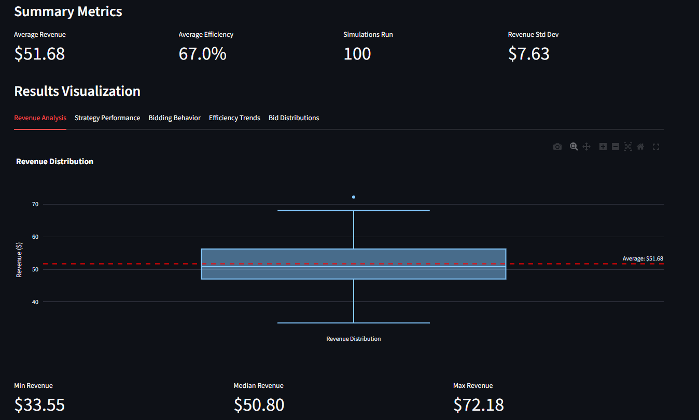
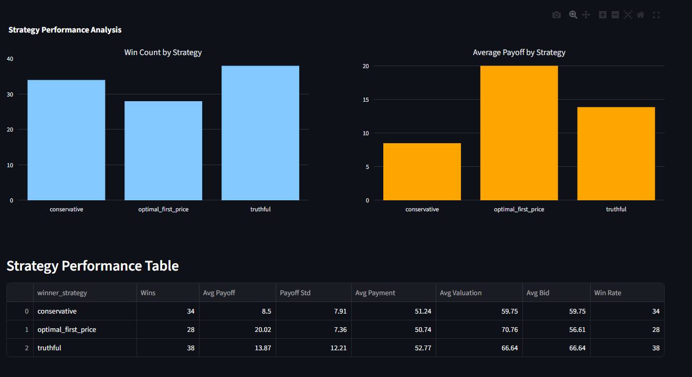
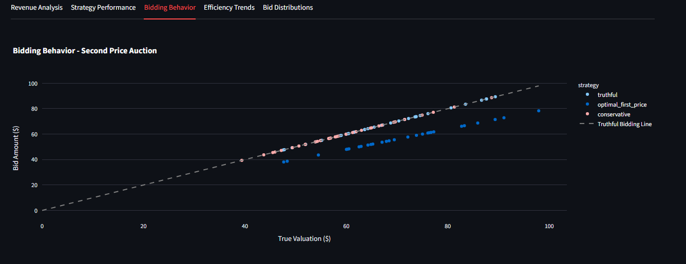
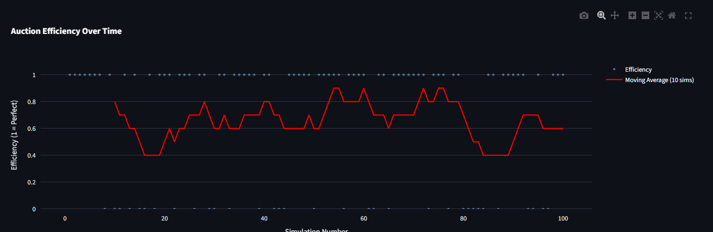
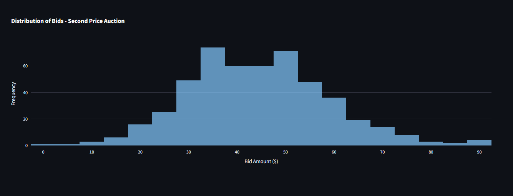

# Auction Strategy Game Simulator

This project simulates different auction types using game theory principles to analyze bidding strategies and outcomes.

## Features

- Multiple auction types (First-price, Second-price/Vickrey)
- Various bidding strategies (Truthful, Aggressive, Conservative)
- Interactive web interface using Streamlit
- Real-time visualization of auction outcomes
- Game theory equilibrium analysis

## Installation

1. Create and activate virtual environment:
```bash
python -m venv venv
source venv/bin/activate  # On Linux/Mac
# or
venv\Scripts\activate  # On Windows
```

2. Install dependencies:
```bash
pip install -r requirements.txt
```

## Usage

Run the Streamlit application:
```bash
streamlit run app.py
```

## Project Structure

- `app.py` - Main Streamlit application
- `auction_simulator/` - Core simulation modules
  - `auctions.py` - Auction type implementations
  - `strategies.py` - Bidding strategy implementations
  - `agents.py` - Agent/bidder classes
  - `utils.py` - Utility functions
- `visualizations/` - Plotting and visualization modules
- `requirements.txt` - Project dependencies

## Technologies Used

- Python 3.8+
- Streamlit (Interactive web interface)
- NumPy (Numerical computations)
- pandas (Data analysis)
- Matplotlib/Plotly (Visualizations)
- SciPy (Statistical distributions)

## Interface Screenshots

### Revenue Analysis


### Strategy Performance


### Bidding Behavior


### Efficiency Trends


### Bid Distributions


#####